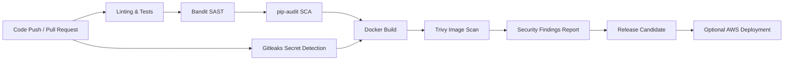

# DevSecOps Security Pipeline

[](https://github.com/Yahmedd/devsecops-security/actions/workflows/devsecops.yml)

A hands-on DevSecOps project focused on securing the software delivery lifecycle of a containerized Flask application through automated testing, static analysis, dependency auditing, secret detection, container scanning, Docker hardening, and controlled cloud deployment.

The application, **Cybertek**, serves as the workload used to demonstrate the pipeline. The primary focus of this repository is the **security automation and controls around the application lifecycle**.

## DevSecOps Pipeline



The public portfolio pipeline demonstrates:

**Code → Test → SAST → SCA → Secret Detection → Docker Build → Container Scan → Optional Deployment**

## Security Controls

| Stage | Tool / Control | Purpose |
|---|---|---|
| Code quality | Flake8 | Detect Python quality issues |
| Automated testing | Pytest | Validate application behavior |
| SAST | Bandit | Detect common Python security weaknesses |
| SCA | pip-audit | Audit dependencies for known vulnerabilities |
| Secret detection | Gitleaks | Detect committed credentials, API keys, and tokens |
| Container build | Docker | Package the application into a reproducible image |
| Container security | Trivy | Report HIGH and CRITICAL OS/library vulnerabilities |
| Runtime hardening | Docker | Reduce container privileges and attack surface |
| Secrets management | Environment variables / AWS Secrets Manager | Keep application secrets outside source code |
| Cloud authentication | GitHub OIDC | Avoid long-lived AWS access keys for deployment |

> Trivy is intentionally configured as an informational security scan in the public portfolio workflow. Findings remain visible in the CI output without blocking the entire demonstration pipeline.

## GitHub Actions

The workflow is defined in:

```text
.github/workflows/devsecops.yml
```

It runs automatically on pushes and pull requests to `main`.

The CI process performs:

1. Dependency installation
2. Python linting
3. Automated tests
4. Bandit static application security testing
5. `pip-audit` software composition analysis
6. Gitleaks secret detection
7. Docker image build
8. Trivy container vulnerability scanning

This provides a compact example of integrating security checks directly into CI/CD rather than treating security as a separate final-stage activity.

## Secret Detection

Gitleaks scans the repository history for patterns associated with credentials, tokens, passwords, and API keys.

The public repository was rebuilt with a fresh sanitized Git history and does not contain the credentials or sensitive artifacts from the original development environment.

Secret scanning is one layer of defense and is complemented by `.gitignore`, environment-based configuration, and repository sanitization.

## Container Hardening

The Docker deployment was hardened for the public portfolio version.

Implemented controls include:

- application runs as an unprivileged user
- no `chmod 777`
- reduced container privileges
- Linux capabilities dropped where possible
- `no-new-privileges`
- read-only root filesystem support through Docker Compose
- dedicated writable application-data location
- local secrets and generated files excluded from the image
- application exposed through Gunicorn on port `8000`

## Secrets Management

The application does not ship with a fixed administrator password or hardcoded Flask session secret.

The Flask secret can be provided through:

```text
SECRET_KEY
```

or retrieved from AWS Secrets Manager using:

```text
AWS_SECRET_ID
AWS_REGION
```

For local development:

```bash
cp .env.example .env
```

Then replace the example values before starting the application.

The local `.env` file is excluded from Git.

# AWS Deployment

Cybertek was also deployed and validated on AWS as part of a separate cloud security project.

The AWS environment implemented a secure multi-tier architecture including:

- Amazon VPC
- public and private subnets
- Route 53
- CloudFront
- AWS Certificate Manager
- AWS WAF
- Application Load Balancer
- Auto Scaling
- Amazon CloudWatch
- AWS CloudTrail
- Amazon GuardDuty
- AWS Secrets Manager
- Amazon S3

The deployment evidence and complete cloud-security architecture are maintained separately so this repository can remain focused on the DevSecOps pipeline.

## AWS Architecture


## Cybertek Secure Deployment


The AWS project also contains validation evidence for WAF filtering, infrastructure monitoring, load-balancer health, and CloudTrail auditing.

### Companion Project

**[AWS Cloud Security Lab →](https://github.com/Yahmedd/aws-cloud-security-lab)**

Together, the two repositories demonstrate the full flow:

**Secure development pipeline → containerized application → secured AWS deployment → monitoring and auditing**

## Optional AWS Deployment Job

The GitHub Actions workflow also contains an optional deployment stage.

The public workflow uses GitHub OpenID Connect rather than permanent AWS access keys.

Expected deployment configuration includes:

### GitHub Secret

```text
AWS_ROLE_ARN
```

### GitHub Variables

```text
AWS_REGION
EB_S3_BUCKET
EB_APP_NAME
EB_ENV_NAME
```

These values are intentionally not included in the public repository.

The historical Cybertek deployment shown above is documented in the companion AWS repository and does not depend on recreating the original lab environment.

## Local Run

Create the local environment file:

```bash
cp .env.example .env
```

Set a secure `SECRET_KEY`, then start the application:

```bash
docker compose up --build
```

The application is exposed locally at:

```text
http://localhost:8000
```

## Repository Structure

```text
devsecops-security/
├── .github/
│   └── workflows/
│       └── devsecops.yml
├── cybertek/
│   └── ...
├── tests/
│   └── ...
├── .dockerignore
├── .env.example
├── .gitignore
├── Dockerfile
├── docker-compose.yml
├── LICENSE
├── pytest.ini
├── README.md
├── run.py
└── SECURITY.md
```

## Public Release Sanitization

The public portfolio version was rebuilt without the original Git history.

Removed or excluded material includes:

- development SQLite databases
- original credentials and passwords
- cached Python files
- local logs and temporary artifacts
- hardcoded application secrets
- internal setup and development notes
- GitLab-specific deployment configuration
- old environment-specific credentials
- generated development files

Example values remaining in configuration files are placeholders only.

## What This Project Demonstrates

- DevSecOps pipeline design
- CI/CD security automation
- Static Application Security Testing
- Software Composition Analysis
- secret detection
- Docker image creation
- container security scanning
- container hardening
- secure configuration management
- GitHub Actions
- AWS deployment controls
- GitHub OIDC
- AWS cloud security integration

## Related Security Projects

### [SOC-as-Code Platform](https://github.com/Yahmedd/soc-as-code-platform)

Automated SOC platform integrating SIEM, IDS, threat intelligence, incident response, forensics, Terraform, and Ansible.

### [AWS Cloud Security Lab](https://github.com/Yahmedd/aws-cloud-security-lab)

Secure multi-tier AWS environment demonstrating network segmentation, WAF, HTTPS, monitoring, auditing, threat detection, load balancing, and Auto Scaling.

## Security Notice

This repository is a sanitized portfolio version of an educational DevSecOps project.

No production credentials, AWS access keys, API tokens, private keys, or sensitive infrastructure data are intentionally included.

## License

MIT
