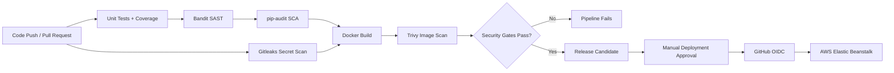

# DevSecOps Security Pipeline

[](https://github.com/Yahmedd/devsecops-security-pipeline/actions/workflows/devsecops.yml)

A portfolio DevSecOps project that secures the software delivery lifecycle of a containerized Flask application with automated testing, static analysis, dependency auditing, secret detection, container vulnerability scanning, hardened Docker runtime controls, and an optional AWS Elastic Beanstalk deployment gate.

The application is intentionally secondary: the main focus of this repository is the **security pipeline and deployment controls around it**.

## Pipeline



## Security Gates

| Stage | Tool / Control | Purpose |
|---|---|---|
| Code quality | Flake8 | Detect Python quality issues before build |
| Automated tests | Pytest + coverage | Validate application behavior |
| SAST | Bandit | Detect common Python security weaknesses |
| SCA | pip-audit | Audit Python dependencies for known vulnerabilities |
| Secret detection | Gitleaks | Block hardcoded credentials and tokens |
| Container build | Docker | Produce the deployment artifact |
| Container security | Trivy | Fail on HIGH/CRITICAL OS and library vulnerabilities |
| Runtime hardening | Docker | Non-root user, read-only root filesystem, dropped capabilities, no-new-privileges |
| Cloud authentication | GitHub OIDC | Avoid long-lived AWS access keys in GitHub |
| Dependency hygiene | Dependabot | Track Python, Docker, and GitHub Actions updates |

## GitHub Actions Workflow

The workflow in `.github/workflows/devsecops.yml` runs automatically on pushes and pull requests to `main`.

The normal CI path is:

1. Install application and security tooling.
2. Run linting and unit tests.
3. Run Bandit SAST.
4. Run `pip-audit` dependency analysis.
5. Scan the Git history with Gitleaks.
6. Build the Docker image only after the code-security gates pass.
7. Scan the resulting image with Trivy.
8. Block the pipeline if HIGH or CRITICAL container vulnerabilities are detected.

AWS deployment is deliberately **manual** and only becomes eligible after the security jobs pass.

## Hardened Container

The original application container was hardened for the public portfolio version:

- runs as an unprivileged `appuser`
- does not use `chmod 777`
- exposes the application on port `8000`
- uses a read-only root filesystem in Docker Compose
- drops Linux capabilities
- enables `no-new-privileges`
- uses a dedicated writable volume only for application runtime data
- excludes local secrets, databases, logs, and generated files from the image context

## Secrets Management

The application does **not** ship with default administrator credentials or a hardcoded Flask session secret.

At runtime, the Flask secret can be supplied through:

1. the `SECRET_KEY` environment variable, or
2. AWS Secrets Manager using `AWS_SECRET_ID` and `AWS_REGION`.

Copy `.env.example` to `.env` for local development and replace the example values. `.env` is excluded from Git.

## Optional AWS Deployment

The `deploy` job is available only through a manual `workflow_dispatch` run after all CI security gates pass.

It uses GitHub's OpenID Connect integration with AWS instead of storing permanent AWS access keys.

Expected repository configuration:

### GitHub secret

- `AWS_ROLE_ARN` — IAM role trusted by GitHub OIDC

### GitHub variables

- `AWS_REGION`
- `EB_S3_BUCKET`
- `EB_APP_NAME`
- `EB_ENV_NAME`

The deploy job packages the application, uploads the source bundle to S3, creates an Elastic Beanstalk application version, and updates the selected environment.

## Local Run

```bash
cp .env.example .env
# Replace the example SECRET_KEY before starting the application.
docker compose up --build
```

Then open:

```text
http://localhost:8000
```

## Repository Structure

```text
devsecops-security-pipeline/
├── .github/
│   ├── workflows/
│   │   └── devsecops.yml
│   └── dependabot.yml
├── cybertek/                 # Flask demo application
├── tests/                    # Pytest test suite
├── .dockerignore
├── .env.example
├── .gitignore
├── Dockerfile
├── docker-compose.yml
├── LICENSE
├── pytest.ini
├── README.md
├── run.py
└── SECURITY.md
```

## Public-Release Sanitization

The portfolio copy was rebuilt without the original Git history and excludes:

- the development SQLite database
- cached Python bytecode
- internal setup/handoff documentation
- fixed/default administrator credentials
- hardcoded fallback application secrets
- GitLab-specific CI configuration and deployment credentials
- local logs and temporary artifacts

All credentials shown in example configuration are placeholders only.

## What This Project Demonstrates

- CI/CD security gates
- DevSecOps workflow design
- SAST and software-composition analysis
- secret detection
- container vulnerability management
- Docker hardening
- secure secret handling
- GitHub Actions automation
- cloud deployment controls
- AWS authentication with OIDC

## License

MIT
